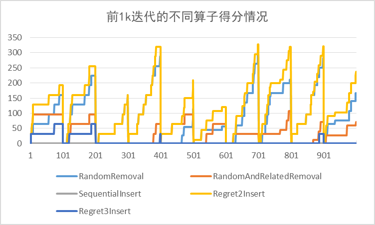
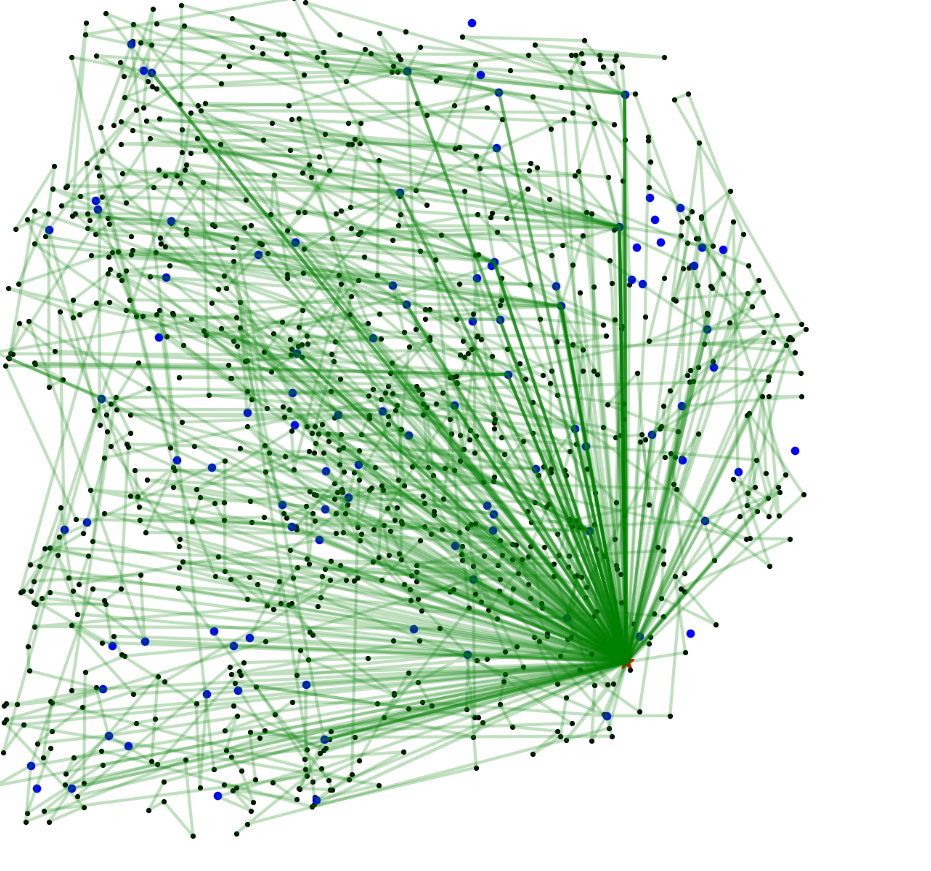
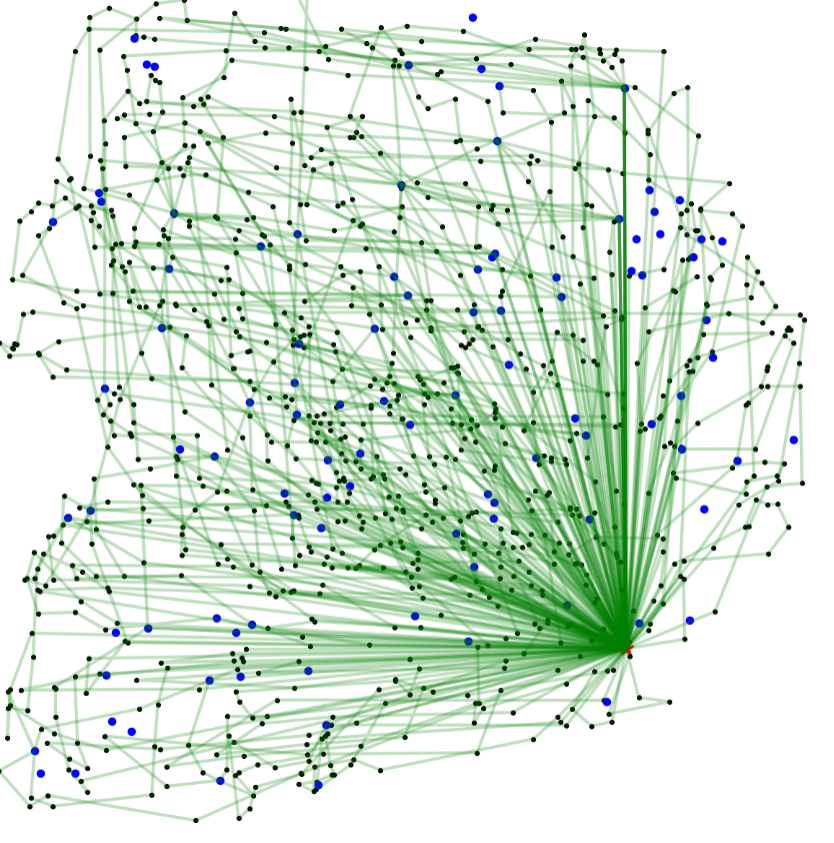

# 2018京东GOC 城市物流运输车辆智能调度

采用ALNS求解带多车型约束、时间窗约束、载重和容量约束、多循环约束和充电站约束以及以运输成本，等待时间成本，充电成本，固定成本的总和最小为目标的混合整数规划模型。

## 目录结构

```
.
├── alns_framework
│   └── src
├── CMakeLists.txt
├── data                        *attention!
│   ├── input_distance-time.txt
│   └── input_node.csv
├── feasibleResults             *attention!
│   └── weight_first_init_00
├── include
├── lib
│   └── libALNS-framework.so
├── param.xml
├── README.md
├── Release.sh
├── results                     *attention!
│   └── weight_first_init_00
├── Setup.sh
├── src
└── stats
    ├── globStatsefsmtw.txt
    └── opStatsefsmtw.txt
```
标有`*attention`的目录及文件是需要赛事数据和初始可行解补全.

## 安装与运行

```shell
mkdir cmake-build-debug && cd cmake-build-debug
cmake ./
make

./alns_efsmtw_mt
```

## 算子效用分析


## 初始解效果可视化


初始解结果效果



ALNS优化结果


gif可视化效果